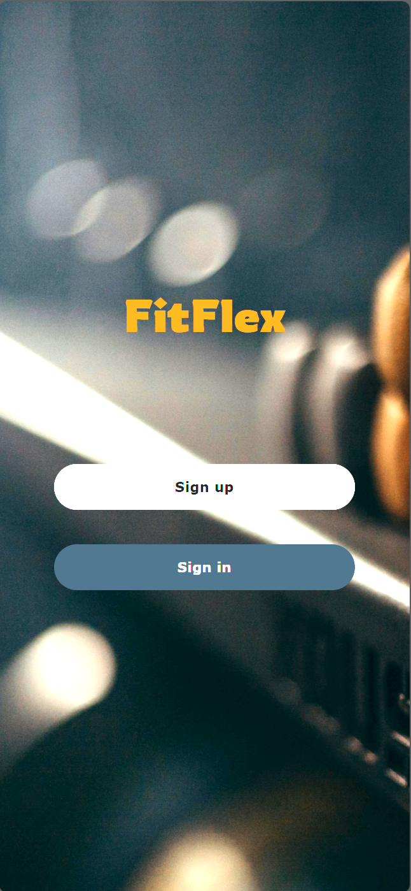
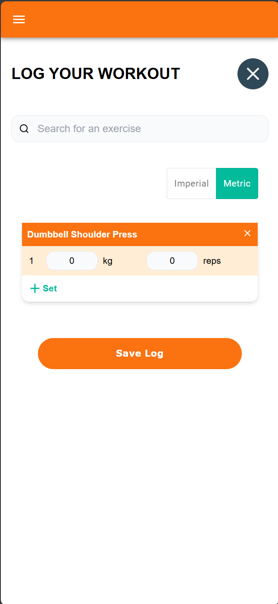

# Fitflex - Strength Training Tracker

The app was created for the Chingu Voyage 49.

It is a mobile-first web application that helps individuals who are interested in fitness and strength training to track their fitness progress by efficiently logging their exercise.

<b>LIVE LINK</b>: https://fit-flex-lime.vercel.app/

## Features

- User Accounts (email/Google account)
- Create a log from scratch
- Create a log from templates
- Unit conversion for logging
- Save logs as a draft
- Save logs as templates
- Templates management
- Logs view in calendar

## Screenshots

## Tech Stack

- NextJS
- Typescript
- MongoDB
- Tailwind w/ MaterialUI

## Local Development

### Setup

- Clone the repo and run `npm i` to install dependencies

### Required environment variables

- Refer to `env.local.sample` for the environment variables
- Create a `.env.local` file at the root of the project.
- Use of Google for an authentication providers with NextAuth.js requires Google Cloud. See documenation: (https://next-auth.js.org/providers/google)

### Running the local development app

- `npm run dev`

## Our Team

- Helena Chen: [GitHub](https://github.com/helenachen03) / [LinkedIn](https://linkedin.com/in/helenachen0308)
- David Eastmond: [GitHub](https://github.com/davideastmond) / [LinkedIn](https://www.linkedin.com/in/david-eastmond-2783ab18a/)
- Tandid Alam: [GitHub](https://github.com/tandid) / [LinkedIn](https://www.linkedin.com/in/tandidalam/)
- Alan Ng: [GitHub](https://github.com/alancln) / [LinkedIn](https://linkedin.com/in/alan-cln)
